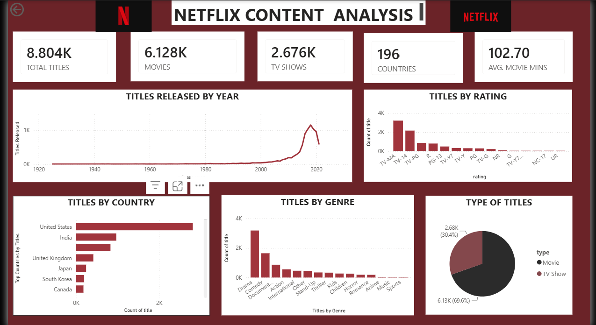

#  Netflix Content Analysis

An end-to-end data analytics project exploring Netflix's content library using data cleaning, exploratory analysis, SQL, and Power BI.

##  Project Overview

This project analyzes Netflix's content catalog to understand patterns and trends across movies and TV shows.

The analysis focuses on content type, genres, ratings, countries, release years, and movie runtime.

The project follows an end-to-end analytics workflow:

**Raw Data → Data Cleaning → Exploratory Analysis → SQL Analysis → Power BI Dashboard**

##  Objectives

- Analyze the distribution of Movies and TV Shows on Netflix
- Identify trends in content releases over the years
- Explore the most common content ratings
- Analyze Netflix content across different countries
- Understand the distribution of genres
- Analyze the average runtime of movies
- Build an interactive dashboard to present key findings

##  Data Cleaning & Exploratory Analysis

The raw Netflix dataset was cleaned and explored using Google Sheets.

The cleaning and preparation process included:

- Handling missing values
- Cleaning and organizing categorical data
- Creating grouped genre categories
- Preparing country information for analysis
- Creating pivot tables for exploratory analysis
- Checking and validating the dataset before visualization

**[Google Sheets – Data Cleaning & Exploratory Analysis](https://docs.google.com/spreadsheets/d/1Ll75Z23cTsOixRQxEJdwgCyDnKePTaSc2CBi71AlSes/edit?usp=sharing)**

##  SQL Analysis

SQL was used to analyze the cleaned dataset and answer analytical questions related to Netflix's content.

The SQL analysis includes queries for:

- Content type distribution
- Release year analysis
- Ratings
- Countries
- Genres
- Movie runtime
- Other content-level insights

##  Power BI Dashboard
  

The cleaned data was used to create an interactive Power BI dashboard.

### Key KPIs

- Total Titles
- Movies
- TV Shows
- Countries
- Average Movie Runtime

### Dashboard Visualizations

- Titles Released by Year
- Titles by Rating
- Titles by Country
- Titles by Genre
- Movie vs TV Show Distribution

### Dashboard Preview

##  Tools Used

- **Google Sheets** – Data cleaning and exploratory analysis
- **SQL** – Data analysis and querying
- **Power BI** – Data visualization and dashboard development

##  Key Skills Demonstrated

- Data Cleaning
- Exploratory Data Analysis
- SQL Querying
- Data Transformation
- Data Visualization
- Dashboard Design
- Analytical Thinking

##  Project Workflow

**Raw Netflix Dataset**  
↓  
**Data Cleaning & Preparation — Google Sheets**  
↓  
**Exploratory Analysis — Pivot Tables**  
↓  
**SQL Analysis**  
↓  
**Power BI Dashboard**
